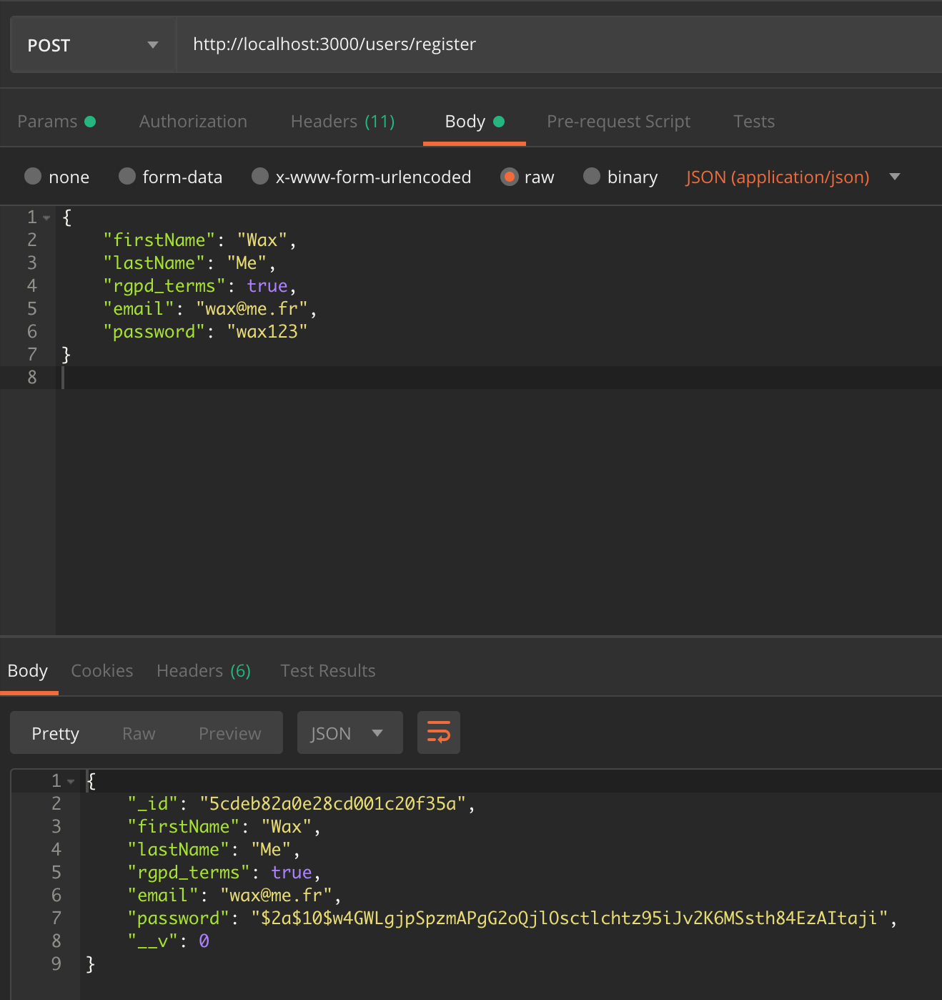

# 4AIW3_mongodb : NODE JS 


## Part 1 - MongoDb, manier, requêter

[MongoDB Documentation](https://docs.mongodb.com/)

- Se co `$ mongo -u root -p password`
- Se co via docker `$ docker-compose exec mongo mongo -u root -p password`
- Affiche toutes les bdd `$ show databases`
- Créer une base/utiliser une base `$ use databasename`
- Insérer de la donnée `$ bd.createCollection('firstColl')`
- Faire tout en même temps : `$ db.firstColl.insert({lastname: "Claude", firstname: "Jean"});`
- restore une bdd avec des dump : `$ docker-compose exec mongo mongorestore -u root -p password`

[mongo Shell Quick Reference — MongoDB Manual](https://docs.mongodb.com/manual/reference/mongo-shell/)

#### Collection: Sakila_
###### 1. Rechercher tous les films avec l'acteur ED CHASE
```
db.Sakila_films.find({ 
  "Actors": { 
    $elemMatch: { 
      "First name": "ED", 
      "Last name": "CHASE" 
    } 
  }
}).count();
```
result: 22

###### 2. Rechercher tous les films dont la description comprend "documentary" et de type "horror"
```
db.Sakila_films.find(
  {
    "Description" : /documentary/i,
    "Category": "Horror"
  }
).count();
```
result: 5

###### 3. Donner le nombre de films en rating "G"
```
db.Sakila_films.find(
  {
    "Rating": "G"
  }
).count();
```
ou plus opti
```
db.Sakila_films.count(
  {
    "Rating": "G"
  }
);
```
result: 178

#### Collection: movies_
###### 4.
```
db.getCollection('video_movieDetails').find({
    $and: [{
            $or: [{
                year: 2013
            }, {
                year: 2012
            }]
        },
        {
            $and: [{
                runtime: {
                    $lte: 150
                },
                runtime: {
                    $gte: 60
                }
            }]
        }
    ]
});
```
ou plus simple:
```
db.video_movieDetails.find({ 
  year : {$in : [2012, 2013] }, 
  runtime : { $gte: 60, $lte : 150}
})
```
###### 5. 
```
db.video_movieDetails.find({ 
  "tomato.image":"certified"
})
```
###### 6. 
```
db.video_movieDetails.aggregate([
  { $group : 
    { _id: “$rated”, count: { $sum: 1 } 
  }
}]);
```

## Part 2 - Un back en Node

### Run le serveur : 
- Verifier qu'on la bonne version de node : `$ docker-compose run server node --version`

(Pour init un projet : `$ docker-compose run server npm init`)

- Démarrer les containers : `$ docker-compose up -d`
- Start le projet : `$ docker-compose up server`

retour attendu : 
```
Starting 4aiw3_mongodb_server_1 ... done
Attaching to 4aiw3_mongodb_server_1
server_1         | 
server_1         | > app@1.0.0 start /home/node/app
server_1         | > node app.js
server_1         | 
server_1         | In app.js
server_1         | Connected to mongoose
```

#### Mongoose :

- Connection : 
```
mongoose.connect(`mongodb://mongo`, {
  user: process.env.MONGODB_USER,
  pass: process.env.MONGODB_PASS,
  dbName: process.env.MONGODB_DBNAME,
  useNewUrlParser: true
});
```
- Création d'un schema :
```
const MovieSchema = mongoose.Schema({
  title: String,
  createdAt: Date,
  ...
```
Pour avoir des validation avec un type requis, des valeurs requise etc :
```
 lastName: {
    type: String,
    required: 'Last name is required',
  },
```

### Express :`

```
POST http://localhost:3000/movies
Content-Type: application/json

{
    "title": "Movie 1",
    "createdAt": "2019-01-01",
    "year": "2019",
    "category": "SF"
}
```


# Run l'app : 
`$ docker-compose run server`

# User



# Run React :
`$ npm run start`

Install cors : `$  docker-compose exec client yarn add cors`